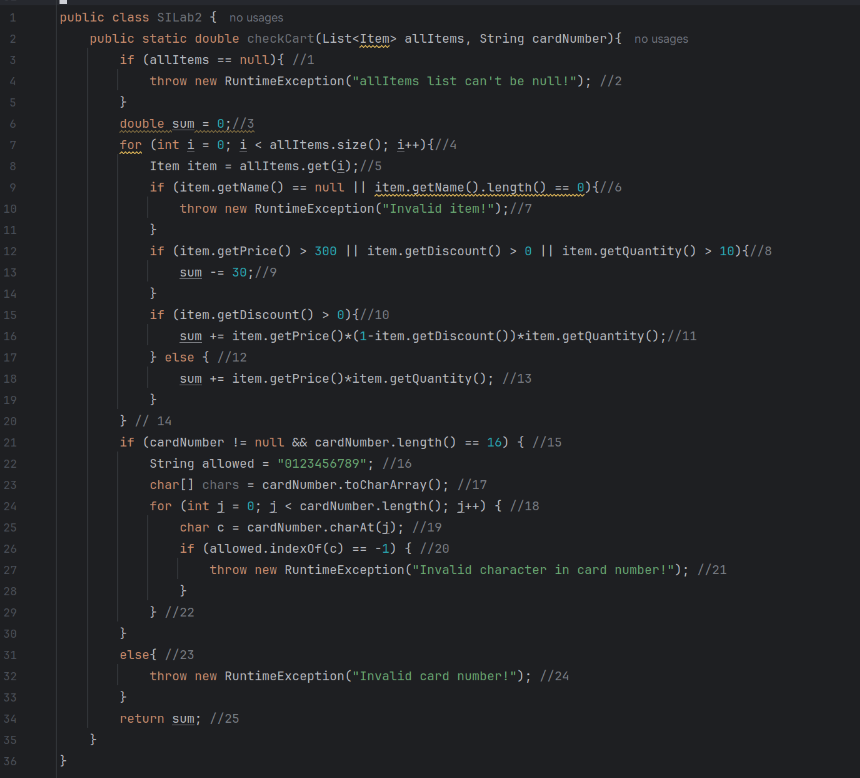

# Втора лабораториска вежба по Софтверско инженерство

## Филип Карамачоски, бр. на индекс 236015 

###  Control Flow Graph

### Цикломатска комплексност

### Тест случаи според критериумот  Every statement

....

### Тест случаи според критериумот Every path

....

### Објаснување на напишаните unit tests

...
...
