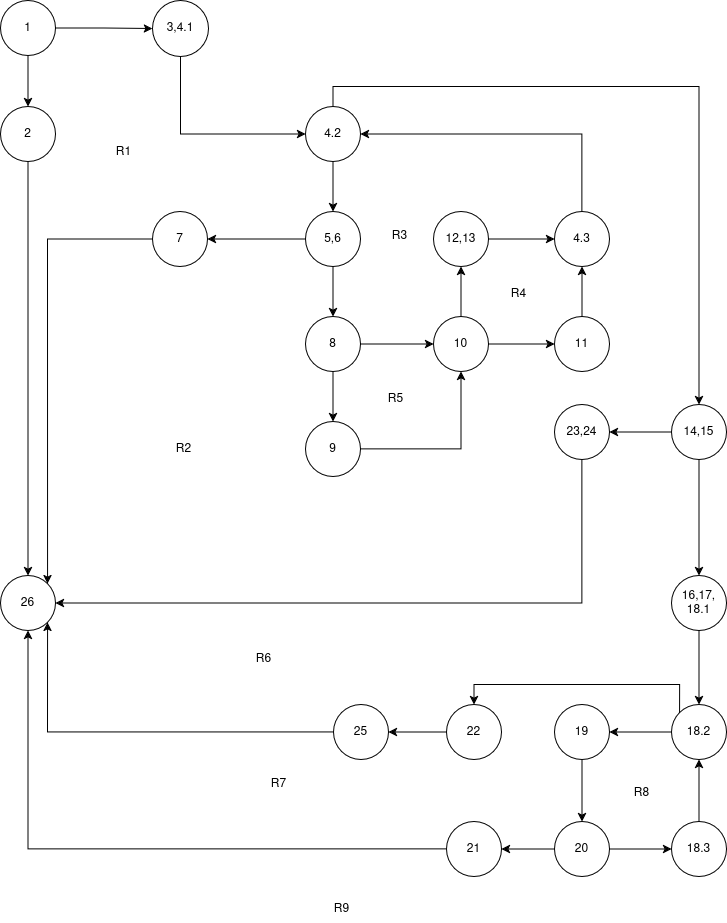
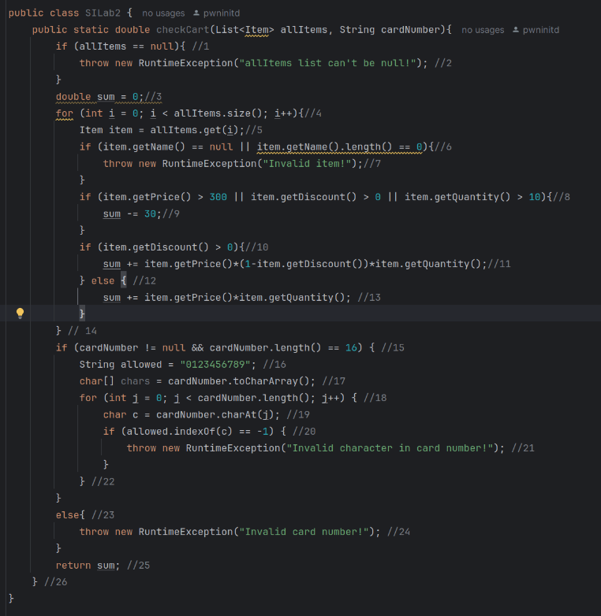

# Втора лабораториска вежба по Софтверско инженерство

## Филип Карамачоски, бр. на индекс 236015 

###  Control Flow Graph




### Цикломатска комплексност

Цикломатската комплексност на овој код е 9, истата ја добив преку борење на регионите како што се обележани на цртежот.

### Тест случаи според критериумот  Every statement

Треба да има минимално 5 тест случаи за да се постигне критериумот Every Statement

Test 1: allItems=null, cardNumber="" - 1, 2, 26

Test 2: allItems=[{name="",quantitiy=1,price=1,discount=0.7}], cardNumber="" - 1, 3, 4.1, 4.2, 5, 6, 7, 26

Test 3: allItems=[{name="Klima",quantitiy=1,price=1,discount=0.7}], cardNumber="1a34567891234567" - 1, 3, 4.1, (4.2, 5, 6, 8, 9, 10, 11, 4.3), 14, 15, 16, 17, 18.1, 18.2, 19, 20, 18.3, 19, 20, 21, 26

Test 4: allItems=[{name="Klima",quantitiy=1,price=1,discount=0}], cardNumber=null - 1, 3, 4.1, (4.2, 5, 6, 8, 10, 12, 13, 4.3), 14, 15, 23, 24, 26

Test 5: allItems=[{name="Klima",quantitiy=1,price=1,discount=0}], cardNumber="1234567891234567" -  1, 3, 4.1, (4.2, 5, 6, 8, 10, 12, 13, 4.3), 14, 15, 16, 17, 18.1, (18.2, 19, 20, 18.3) 22, 25

### Тест случаи според критериумот Multiple Condition 

Треба да има минимално 4 тест случаи за да се постигне критериумот Multiple Condition. `if (item.getPrice() > 300 || item.getDiscount() > 0 || item.getQuantity() > 10)` со помош на Lazy Evaluation TXX, FTX, FFT, FFF

Test 1: allItems=[{name="Klima",quantitiy=1,price=301,discount=0.7}], cardNumber="1234567891234567" - TXX

Test 2: allItems=[{name="Klima",quantitiy=1,price=0,discount=0.7}], cardNumber="1234567891234567" - FTX

Test 3: allItems=[{name="Klima",quantitiy=11,price=0,discount=0}], cardNumber="1234567891234567" - FFT

Test 4: allItems=[{name="Klima",quantitiy=0,price=0,discount=0}], cardNumber="1234567891234567" - FFF

### Објаснување на напишаните unit tests

```java
    @Test
    void testEveryStatement(){
        List<Item> allItems = new ArrayList<Item>();
        Item item = new Item("", 1,1,0.7);
        allItems.add(item);

        RuntimeException e = assertThrows(RuntimeException.class, ()->SILab2.checkCart(null, ""));
        assertTrue(e.getMessage().contains("allItems list can't be null!"));

        e = assertThrows(RuntimeException.class, ()->SILab2.checkCart(allItems, ""));
        assertTrue(e.getMessage().contains("Invalid item!"));

        item = new Item("Klima", 1,1,0.7);
        allItems.removeFirst();
        allItems.add(item);
        e = assertThrows(RuntimeException.class, ()->SILab2.checkCart(allItems, "1a34567891234567"));
        assertTrue(e.getMessage().contains("Invalid character in card number!"));

        e = assertThrows(RuntimeException.class, ()->SILab2.checkCart(allItems, null));
        assertTrue(e.getMessage().contains("Invalid card number!"));

        item = new Item("Klima", 1,1,0);
        allItems.removeFirst();
        allItems.add(item);
        assertEquals(1,SILab2.checkCart(allItems, "1234567891234567"));
    }
```

За тестовите кои го исполнуваат Every Statement критериумот користам assertThrows со цел да ги фатам exceptions-от кој ги фрла функцијата за да можам да ги споредам дали всушност се токму тие exceptions кои ги очекуваме. Додека на крајниот тест не очекуваме никакви exceptions и затоа користам assertEquals со цел да можам да го проверам дали резултатот на програмата е точен.


``` java
    @Test
    void testMultipleCondition(){
        List<Item> allItems = new ArrayList<Item>();
        Item item = new Item("Klima", 1,301,0);
        allItems.add(item);

        assertEquals(271, SILab2.checkCart(allItems, "1234567891234567"));

        item = new Item("Klima", 11,30,0);
        allItems.removeFirst();
        allItems.add(item);
        assertEquals(300, SILab2.checkCart(allItems, "1234567891234567"));

        item = new Item("Klima", 1,35,0.1);
        allItems.removeFirst();
        allItems.add(item);
        assertEquals(1.5, SILab2.checkCart(allItems, "1234567891234567"));

        item = new Item("Klima", 0,0,0);
        allItems.removeFirst();
        allItems.add(item);
        assertEquals(0, SILab2.checkCart(allItems, "1234567891234567"));

    }
```

За тестовите Multiple Condition користам assertEquals со цел да го проверам текот на програмата и да видиме според вредностите како се менува резултатот.
